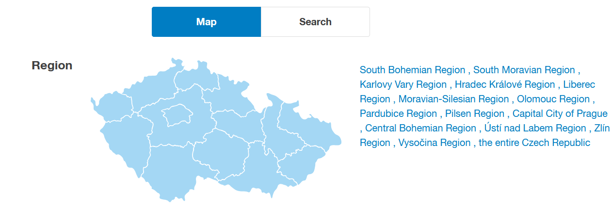

# Locations

This module allows the user to switch between already implemented locations and to define new, custom, locations.

## Supported locations

- Prague
- Brno

## Implementing a new location

When implementing a new location, many values have to be changed in order for the scrapers to properly download data related to your desired search location. This README goes over all the supported websites.

When implementing a new location, derive from the `BaseLocation` abstract class and fill in all the data necessary inside the `_location_impl` property based on the following tutorial.

```python
class MyCustomLocation(LocationBase):
    @property
    def name(self) -> str:
        return "My Custom"

    @property
    def _location_impls(self) -> list[ScraperLocationImpl]:
        return [
            BezrealitkyLocationImpl(...),
            EuroBydleniLocationImpl(...),
            ...
        ]
```

### [BezRealitky](scraper_location_impl/bezrealitky.py)

- Open [https://www.bezrealitky.cz/](https://www.bezrealitky.cz/), search for you location, find the location code inside the page's url under the name `regionOsmIds`.

### Bravis

- Only available in Brno.

### [Eurobydlení](scraper_location_impl/euro_bydleni.py)

- `input` and `city` seem to default to the same value and have next to know meaning for the search.
- `lat` and `lng` (latitude, longitude) seem to have some effect.
- `south`, `west`, `north`, `east` define the actual rectangle of the search area and are the most important for proper search. Change these values based on you location. To view and retrieve the coordinates all at the same time, we recommend to use this online app [https://www.keene.edu/campus/maps/tool/](https://www.keene.edu/campus/maps/tool/).

### [iDNES Reality](scraper_location_impl/idnes_reality.py)

- Search for any location and then use the name displayed in the url. For example `praha`: `https://reality.idnes.cz/s/pronajem/byty/praha/`.

### [REALCITY](scraper_location_impl/realcity.py)

- The url is super weird. Search for your location and copy the name along with the number ID from the start of the url. For example `praha-2064`: `https://www.realcity.cz/pronajem-bytu/praha-2604?...`.

### [Realingo](scraper_location_impl/realingo.py)

- TODO

### [Remax](scraper_location_impl/remax.py)

- To search the whole Prague, we have to search Prague as a region, not as a city.
- For other big cities:
  - Go to [https://www.remax-czech.cz](https://www.remax-czech.cz).
  - Click on "Flats".
  - Click on "Show detailed filter".
  - At least one disposition has to be ticked for the region codes to show.
  - Navigate to this map:
  - 
  - Choose you region and or a city.
- If a region is to be searched, just copy-paste the regions name and set `region` to `True`:
  - `https://www.remax-czech.cz/reality/byty/jihocesky-kraj/...`
  - ```python
    RemaxLocationImpl("jihocesky-kraj", True)
    ```
- If a city is to be searched, copy the code in the url:
  - `https://www.remax-czech.cz/reality/vyhledavani/?hledani=2&regions[35][3308]=on/...`
  - ```python
    RemaxLocationImpl("[35][3308]", True)
    ```

### [Sreality](scraper_location_impl/sreality.py)

- TODO
- We need to retrieve region and district ID, we were not able to find any official documentation of these mappings.
- Regions are easy - just search from `1` to `14`.
- This should be visible somewhere in Network Requests, we were not able to locate it.

### [Ulov Domov](scraper_location_impl/ulov_domov.py)

- Again, we define a search area based on GPS coordinates:
  - `north_east_lat`,
  - `north_east_lng`,
  - `south_west_lat`,
  - `south_west_lng`.

